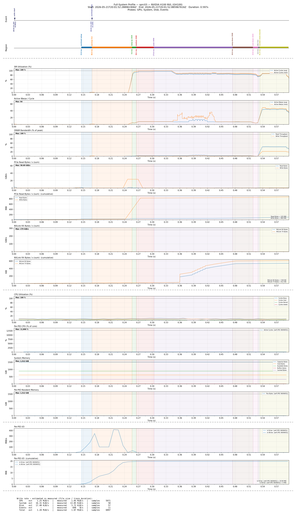

# cupti-profiler

Low-overhead, full-system profiler for CUDA workloads. Wraps NVIDIA
**CUPTI PM Sampling** (continuous hardware-counter streaming, no kernel
replay or serialization) with parallel CPU / memory / disk probes and a
named-region / instantaneous-event timeline. Drives from C++ or Python.
Renders to static PNG, interactive Bokeh HTML, or whatever you want
to build on top of the protobuf-serialized traces.

[](LICENSE)

```text
GPU PM samples (10 kHz)  ┐
CPU + memory ticks       │
Per-process CPU / RSS    ├──► five .pb files ──►  visualize_all.py / visualize_interactive.py
Per-device disk I/O      │
Per-process disk I/O     │
Named regions + events   ┘
```

## What you get

- **One coordinated trace, all probes synchronized.** Every probe writes
  its own length-delimited `.pb` file, anchored to the same
  `steady_clock` reference, so the GPU SM utilization curve, CPU
  saturation, disk read rate, and your `mark_event("checkpoint saved")`
  marker line up on a single timeline.
- **PM Sampling, not kernel-replay.** No artificial slowdowns, no
  cuBLAS calls being run multiple times to gather counters. The
  workload runs at full speed; samples are streamed off the GPU's PM
  buffer in the background. Default 10 kHz on Ampere+. See
  [`docs/cupti-overhead-analysis.md`](docs/cupti-overhead-analysis.md)
  for what the overhead landscape looks like across CUPTI features.
- **Multi-domain regions and events.** A `Generic` (host
  `steady_clock`) and a `GPU` (CUPTI clock) `EventTracker` per process,
  each thread-safe. `Generic` is for host phases (data load, model
  build, eval); `GPU` records `cudaEvents` on a stream you control so
  region timestamps stay aligned with the workload. See
  [`docs/full-system-overview.md`](docs/full-system-overview.md).
- **Drive from C++ or Python, identical config.** Both
  [`examples/full_system_profiling.cu`](examples/full_system_profiling.cu)
  and [`examples/full_system_profiling.py`](examples/full_system_profiling.py)
  load the same [`configs/example.pbtxt`](configs/example.pbtxt) by
  default and produce identical output sets. The Python wrapper
  forwards the full API surface and ships `.pyi` type stubs so editor
  autocomplete and type checking work out of the box.
- **Interactive viewer.** `visualize_interactive.py` builds a Bokeh
  HTML with synced pan/zoom across every panel, hover tooltips at the
  cursor's x position, dashed-line crosshair, and a built-in HTTP
  server for SSH-tunneled remote viewing.

## Sample output

A run of [`examples/full_system_profiling.py`](examples/full_system_profiling.py)
(GEMM ramp + `vecAdd` workload) rendered with `visualize_all.py`:



## Repository layout

```
cupti-profiler/
├── lib/                  C++ shared library (the actual profiler core)
├── python/               pybind11 wrapper + pyproject.toml-installable package
├── examples/             gemm_profiling.cu, full_system_profiling.{cu,py}
├── tools/                CLI utilities (visualizers, list_pm_metrics)
├── proto/                .proto schemas (data + config)
├── tests/                pytest smoke test for the Python wrapper
├── configs/              example .pbtxt the examples load by default
└── docs/                 architecture / overhead / integration notes
```

For full descriptions of each tool and example see
[`docs/tools/README.md`](docs/tools/README.md) and
[`docs/examples/README.md`](docs/examples/README.md).

## Installation

This project is **pip-installable**. The `pyproject.toml` drives the
existing CMake build through `scikit-build-core`, so a single
`pip install` fetches build deps in isolation, runs CMake, builds the
C++ library plus the pybind11 extension, and lays out an importable
Python package.

### As a Python dependency in your own project

```bash
# As a git submodule of your project (recommended for HEAD-tracking):
git submodule add https://github.com/<you>/cupti-profiler third_party/cupti-profiler
git submodule update --init --recursive
pip install -e third_party/cupti-profiler --no-build-isolation

# Or directly from a checkout:
pip install /path/to/cupti-profiler
```

After install, `import cupti_profiler` works anywhere in the active env
— no `PYTHONPATH`, no `LD_LIBRARY_PATH`. The package bundles
`libcupti_profiler.so`, the pybind11 extension, type stubs, and the
generated protobuf classes (under `cupti_profiler.proto.*`).

For more options (build a wheel for cross-machine deployment, or use
`PYTHONPATH` for active development), see
[`docs/integration.md`](docs/integration.md).

### From source (C++ + Python in one go)

```bash
# 1. Install Python build deps in the env you want to use this from:
pip install -r requirements.txt

# 2. Configure + build:
cmake -S . -B build
cmake --build build -j

# Outputs:
#   build/lib/libcupti_profiler.so                          # C++ shared library
#   build/examples/{gemm,full_system}_profiling             # C++ example binaries
#   build/python/cupti_profiler/                            # staged Python package
#       _native.cpython-*.so + .pyi stubs + proto/*_pb2.py
```

For the C++ side standalone, the `lib/` target is `cupti_profiler` and
its public headers live at `lib/include/cupti_profiler/*.h`.

### System requirements

- **CUDA Toolkit ≥ 12.0** (CUPTI ships with the toolkit). Tested on 12.8.
- **GPU**: Turing or newer (compute capability ≥ 7.5). PM Sampling's
  `GPU_TIME_INTERVAL` trigger needs Ampere+ for stable sampling.
- **Linux**, glibc-based. The system profiler reads `/proc`; the disk
  profiler reads `/proc/diskstats` and `/sys/block/*/inflight`.
- **CMake ≥ 3.18**, **Python ≥ 3.8**, a C++20 compiler (GCC ≥ 10 or Clang ≥ 12).
- **Per-process disk I/O** (`/proc/<pid>/io`) needs same-UID or
  `CAP_SYS_PTRACE` — the profiler warns once and skips it gracefully
  if unavailable.

## Quick start

```bash
# 1. Build (installs the Python package alongside via cmake's staging step):
cmake -S . -B build && cmake --build build -j

# 2. Pick an example.
#    C++:
build/examples/full_system_profiling
#    Python (after `pip install -e .`):
python examples/full_system_profiling.py
# Both default to configs/example.pbtxt — output goes to ./profiling_output/.

# 3. Visualize (single positional arg = the manifest):
python tools/visualize_all.py profiling_output/session_metadata.pb \
    -o profiling_output/profile.png

# Or render an interactive HTML viewer (with synced pan/zoom + crosshair):
python tools/visualize_interactive.py profiling_output/session_metadata.pb
# → opens at http://localhost:8000/
```

### Annotating your own workload

```python
import cupti_profiler as cp

suite = cp.ProfilerSuite()
cp.configure_suite(suite, {
    "output_dir": "my_run/",
    "events": {"enabled": True, "flush_interval_ms": 200,
               "output_file": "events.pb"},
    "gpu":    {"enabled": True, "device_index": 0,
               "sampling_frequency_hz": 10_000,
               "metrics": ["sm__cycles_active.avg",
                           "sm__cycles_elapsed.avg",
                           "dram__read_throughput.avg.pct_of_peak_sustained_elapsed"],
               "output_file": "gpu_metrics.pb"},
    # system / disk blocks similarly...
})
suite.start()

ep  = suite.get_event_profiler()
gen = ep.get_generic_tracker()  # host steady_clock domain
gpu = ep.get_gpu_tracker()      # CUPTI clock domain — pass a CUDA stream

# ... run your workload, with begin_region / end_region / mark_event ...
gen.mark_event("training start")
rid = gen.begin_region("epoch 0")
# ... epoch ...
gen.end_region(rid)

suite.stop()
```

For the full Python API (with parameter names + docstrings forwarded to
`.pyi` stubs) see `python/binding.cpp` or any IDE pointed at the
installed package.

## Tools

| Tool | What it does |
|---|---|
| [`list_pm_metrics`](tools/src/list_pm_metrics/list_pm_metrics.cpp) | Enumerate CUPTI PM-samplable metrics on the local GPU |
| [`visualize_single.py`](tools/visualize_single.py) | Static PNG of a single `gpu_metrics.pb` |
| [`visualize_all.py`](tools/visualize_all.py) | Static PNG of a full-system run, manifest-driven |
| [`visualize_interactive.py`](tools/visualize_interactive.py) | Bokeh HTML of the same data with synced pan / zoom / crosshair |

Detailed usage in [`docs/tools/README.md`](docs/tools/README.md).

## Documentation

- [`docs/full-system-overview.md`](docs/full-system-overview.md) —
  what each probe collects and how they fit together.
- [`docs/full-system-internals.md`](docs/full-system-internals.md) —
  threading model, sync anchors, flush mechanics.
- [`docs/system-guide.md`](docs/system-guide.md) — end-to-end build +
  use guide.
- [`docs/cupti-overhead-analysis.md`](docs/cupti-overhead-analysis.md) —
  overhead characteristics of CUPTI subsystems and why this project
  uses PM Sampling.
- [`docs/integration.md`](docs/integration.md) — how a sibling
  project should depend on this one (submodule + `pip install -e .` is
  the recommended path).
- [`docs/examples/`](docs/examples/) — per-example walkthroughs.
- [`docs/tools/README.md`](docs/tools/README.md) — per-tool reference.

## License

MIT — see [`LICENSE`](LICENSE).
