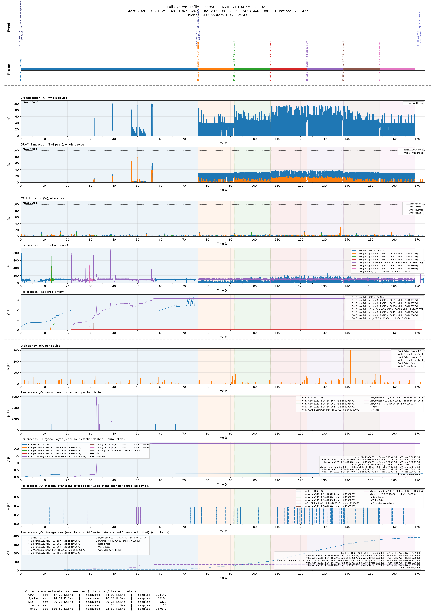

# `vllm_serving_profiling.py` — a live vLLM server, process by process

Source: [`examples/vllm_serving_profiling.py`](../../examples/vllm_serving_profiling.py)
· panel layout: [`configs/vllm_serving_panels.pbtxt`](../../configs/vllm_serving_panels.pbtxt)

A `vllm serve` process is a tree: the API server you start, the
`EngineCore` it forks (which renames itself to `VLLM::EngineCore` after the
fork), a multiprocessing helper, and during startup a stream of short-lived
workers (compile workers, `ldconfig`, `ninja`, ...). This example traces
every one of them, from spawn to shutdown, from a small launcher.



## What it does

1. Builds a `ProfilerSuite` with the **System and Disk probes in SIDECAR
   mode** (the samplers run in the `cupti-profiler-sidecar` child, not in
   the launcher), **descendant tracking on, recursive, 100 ms scan**, and an
   Events probe for the phase markers. With `--gpu`, also the GPU probe
   (see [GPU](#gpu-device-wide-counters-from-the-launcher)).
2. Starts `vllm serve <model>` and **immediately** calls
   `suite.add_tracked_process(pid, "vllm", track_descendants=True)`, before
   the server is ready, so the startup workers are found while they exist.
3. Waits for `/v1/models`, then drives six batches of completions, each for
   1/6 of `--load-seconds` (default 90 s), at concurrency 4, 16, 64, 64,
   16, 4. Every request has a fresh random prompt of 32–3000 words (so the
   prefix cache cannot short-cut it) and a fixed output of 16, 64 or 256
   tokens (`ignore_eos`). Each batch is a region in the trace.
4. Sends `SIGTERM` to the server, stops the suite, prints the trace's
   **process table**, and renders the figure with
   [`tools/visualize_all.py`](../tools/README.md) and the example's panel
   layout.

## Run

```bash
# the library importable (pip install . , or PYTHONPATH=build/python),
# and vLLM installed somewhere
python examples/vllm_serving_profiling.py --vllm /path/to/venv/bin/vllm --gpu
```

Every machine- or user-specific value is an argument:

| Argument | Default | What |
|---|---|---|
| `--model` | `Qwen/Qwen3.5-0.8B` | model to serve |
| `--vllm` | `vllm` (on `PATH`) | the `vllm` executable |
| `--host`, `--port` | `127.0.0.1`, `8000` | where the server listens |
| `--output-dir` | `vllm_serving_profile` | trace directory; the figure is `<dir>/vllm_serving.png` unless `--png` |
| `--system-hz`, `--disk-hz` | 100, 100 | sampling rates |
| `--scan-interval-ms` | 100 | descendant tracking scan interval |
| `--flush-ms` | 1000 | probe flush interval |
| `--disk-device` | every whole block device in `/sys/block` | devices for the per-device panel (repeatable) |
| `--gpu`, `--gpu-device`, `--gpu-hz` | off, 0, 1000 | GPU PM sampling from the launcher |
| `--load-seconds` | 90 | duration of the request load |
| `--ready-timeout` | 900 | seconds to wait for `/v1/models` |
| after `--` | — | passed to `vllm serve` unchanged, e.g. `-- --max-model-len 4096` |

**What you set in the environment** (the example does not):

- **Where the weights are.** `vllm serve` downloads into the Hugging Face
  cache unless it finds them. For a shared, pre-populated cache, point the
  hub at it: `HF_HUB_CACHE=<dir that contains models--Qwen--Qwen3.5-0.8B>`
  (note: `HF_HOME=<dir>` looks in `<dir>/hub`, which is not the same
  directory), and `HF_HUB_OFFLINE=1` to forbid downloads.
- **CUDA.** Whatever vLLM needs, and for `--gpu` the CUPTI the library was
  built against on `LD_LIBRARY_PATH`. On a node whose driver is older than
  the CUDA toolkit, the toolkit's `compat` directory goes first on
  `LD_LIBRARY_PATH` (forward compatibility).
- The launcher's Python needs only the library (plus numpy and matplotlib
  for the figure); vLLM runs as its own executable, so its environment can
  be a different one.

## Reading the figure

Top to bottom: events (spawn, ready, shutdown) and the load batches as
regions; GPU (with `--gpu`); whole-host CPU; **per-process CPU and resident
memory**; per-device disk bandwidth; **per-process I/O** at the syscall layer
(`rchar` solid, `wchar` dashed) and the storage layer (`read_bytes` solid,
`write_bytes` dashed, `cancelled_write_bytes` dotted), each with its
cumulative companion.

Each process keeps one colour in every panel. Its label is its alias from the
process table: the root is `vllm`; processes found by descendant tracking are
`vllm/<comm>` **and say which tracked parent they were found under**
(`child of <pid>`). EngineCore appears under its renamed comm,
`vllm/VLLM::EngineCor` (comm is 15 characters), because the alias follows
renames; its rename history is in the table below.

### The run in the figure

`Qwen/Qwen3.5-0.8B` on one H100 NVL, vLLM 0.29 from PyPI, `--gpu`, the
defaults otherwise (100 Hz, 100 ms scan), `-- --max-model-len 4096
--gpu-memory-utilization 0.80`, warm compile caches. The server was ready
89 s after spawn and served 2844 requests in the 90 s of load, none failed.
What the example printed at the end, the trace's process table (times from
the start of the trace; CPU = head + samples + exit tail):

| pid | parent | kind | comm (history) | start s | end s | CPU s |
|---|---|---|---|---|---|---|
| 1539437 | 1539403 | root | `vllm` | 0.02 | 185.98 | 73.73 |
| 1539699 | 1539437 | discovered | `python3.12` | 14.65 | 17.27 | 2.49 |
| 1539701 | 1539437 | discovered | `python3.12` | 14.70 | 17.27 | 2.44 |
| 1539703 | 1539437 | discovered | `vllm` | 14.92 | 14.93 | 0.00 |
| 1539842 | 1539437 | discovered | `python3.12` | 25.61 | 185.34 | 0.05 |
| 1539843 | 1539437 | discovered | `python3.12` → `VLLM::EngineCor` | 25.62 | 184.69 | 137.60 |
| 1539944 | 1539843 | discovered | `python3.12` | 34.47 | 36.74 | 2.48 |
| 1539946 | 1539843 | discovered | `python3.12` | 34.52 | 36.72 | 2.46 |
| 1540246 | 1539843 | discovered | `VLLM::EngineCor` | 45.92 | 45.93 | 0.00 |
| 1540454 | 1539843 | discovered | `VLLM::EngineCor` | 58.91 | 58.94 | 0.00 |
| 1540507 | 1539843 | discovered | `ninja` | 65.41 | 65.53 | 0.03 |

The **root** (1539437, `vllm`) is the API server; kind `root` because the
launcher listed it. **EngineCore** (1539843) was found as `python3.12` 25.6 s
in, before it renamed itself, and its alias followed the rename. The
**multiprocessing helper** (1539842) lives for the whole run at ~0 CPU. The
rest are **startup transients**: two pairs of short-lived Python workers
(~2.5 s of CPU each; one pair under the API server, one under EngineCore),
EngineCore's brief forks (still carrying its comm), and a `ninja` build step.
Processes that lived less than one scan interval can be missing: in this run
the oracle below saw 3 such (`file` and two forks), each alive for a single
10 ms poll.

The panels line up with vLLM's own log (times from the start of the trace):
EngineCore starts at 25.6 s and loads the weights at ~38 s (the 1.6 GiB step
in its cumulative `rchar`); its profiling warmup run (~47–54 s) and CUDA
graph capture (~54–62 s) are the GPU activity during startup and its bursts
of several cores; its init finishes at ~67 s, and the API server, busy at
~100% of a core through most of startup, spends ~20 s more on multi-modal
warmup before it answers `/v1/models` at 89 s. Under load both run near one
core each; resident memory grows to ~3 GiB in each. (`torch.compile` was a
cache hit here, 0.4 s; with cold caches startup takes minutes and spawns
many more short-lived compiler processes, each traced if it lives ≥ 100 ms.)

### Checked on six runs

Two jobs, six runs (two without `--gpu`, then two pairs alternating), with a
test-only oracle polling the run's cgroup every 10 ms and the launcher's
`getrusage(RUSAGE_CHILDREN)`:

| | result |
|---|---|
| Completeness: every process the oracle saw alive ≥ 100 ms is in the trace (both probes) | **6/6 runs** (7–8 such processes per run, 0 missed); the 3–9 missed per run were each seen alive ≤ 10.5 ms |
| Per-process CPU of the whole tree (Σ head + samples + tails) vs `getrusage(RUSAGE_CHILDREN)` once vLLM was reaped | trace **15–44 ms below** out of 196–221 s (0.008–0.020%). What the trace cannot hold: the root's CPU after its last sample (a root has no exit tail: its parent, the launcher, is not tracked), and the CPU of the missed sub-100 ms processes |
| Descendant tracking scan (the trace's `DiscoveryStats`) | p50 0.72–1.25 ms, p99 1.7–2.8 ms, 7–10 processes discovered, all seen exiting |
| The sidecar's own CPU (exact, from `getrusage` across `stop()`) | **8.6–14.6% of one core** over the run, unpinned. 8.6% in the one run on a quiet node without `--gpu`; 13.2–14.6% while the node was 40–70% busy with other jobs or the launcher ran the GPU probe beside it. Pin it with `sidecar_cpus` to keep it off the server's cores |

## GPU: device-wide counters from the launcher

CUPTI PM Sampling runs in the launcher's own CUDA context, but the counters it
samples are the **device's**: SM activity, warps and DRAM throughput include
every context on the GPU, vLLM's among them. Measured in this example's runs:

| window | SM active (% of peak, mean) — run in the figure | second run | third run |
|---|---|---|---|
| startup (spawn → ready) | 0.9 | 0.9 | 0.9 |
| load, concurrency 4 / 16 / 64 / 64 / 16 / 4 | 25.7 / 27.1 / 37.9 / 34.6 / 26.0 / 25.7 | 23.6 / 22.2 / 31.0 / 32.2 / 18.7 / 17.5 | 24.8 / 23.8 / 32.0 / 33.1 / 25.0 / 24.8 |
| idle, after the load | 0.0 | 0.0 | 0.0 |

SM activity follows vLLM's load, so **from a launcher the GPU panels are
meaningful, device-wide**. It did not conflict with vLLM: every run started
and served every request. It may cost a little: in each of the three pairs
of runs with and without `--gpu`, the `--gpu` run completed 4.5–8.0% fewer
requests in the same 90 s, a spread that n = 3 cannot separate from
run-to-run noise (up to 11% between runs of the same kind). `--gpu` is
therefore off by default.

What the launcher cannot give you: anything per context or per kernel
(the counters are whole-device, so another job on the same GPU would show up
too), and CUDA-event regions on vLLM's streams, which need the profiler
inside the server. The launcher's GPU probe costs a CUDA context on the
device (hence `--gpu-memory-utilization` below 0.9 in the runs here) and
one CPU thread in the launcher.

## I/O: what the per-process counters show for a model server

- **Weight loading shows in the syscall layer, not the storage layer.**
  vLLM 0.29's default safetensors loader reads the checkpoint with `read()`:
  EngineCore's `rchar` grows by the checkpoint's size (1.63 GiB for
  `Qwen/Qwen3.5-0.8B`) in about 0.5 s (vLLM logs "Loading weights took
  0.54 seconds"), while `read_bytes` stays at 0
  because the file is already in the page cache. **A loader that `mmap`s
  from a warm cache would be invisible to every per-process counter**; see
  [per-PID I/O counters](../metric-model.md#per-pid-io-counters-who-records-what).
- **Reaped children's I/O is not counted twice.** When a process reaps a
  child, the kernel adds the child's lifetime I/O to the parent's
  `/proc/<pid>/io`: at shutdown, when the API server reaps EngineCore,
  EngineCore's ~2.4 GiB of `rchar` lands in the API server's counters
  (and, smaller, when EngineCore reaps its compile workers during
  startup). Since both are traced, the profiler subtracts each reaped
  traced child's last reading from its parent and records an
  `IoReapAdjustment`, so per-process I/O is each process's own and sums
  over the tree correctly; see
  [reaped children's I/O](../system-guide.md#reaped-childrens-io).
  **The figure above predates this** (it was recorded before the change):
  it still shows the API server's one-sample jump at shutdown, which
  stretches the syscall-layer rate axis.
- `wchar` includes socket and pipe traffic (the server's responses, its
  log on stdout), so it is not a file-write rate.

## Limits

- A process that lives shorter than one scan interval (100 ms) can be
  missed; its CPU still shows up in its parent's exit tail if the parent is
  tracked and reaps it, and its I/O in the parent's (never subtracted,
  since it was never counted separately).
- Per-sample CPU of another process is quantized to scheduler ticks
  (4 ms at `CONFIG_HZ=250`): single samples of a busy process jitter
  around their true value; sums over time are exact.
- The per-device disk panel counts every process on the machine.
